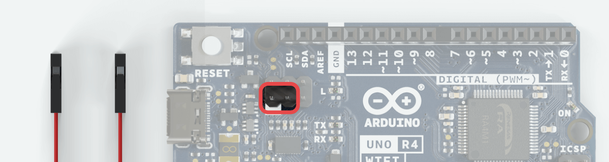

# Arduino UNO R4 WiFi

> __Note__: we're not responsible for any possible board damage, etc. Proceed at your own risk!

## 1. Switch the `UNO R4 WiFi` into ESP mode, upload `Blynk.NCP` firmware

1. Disconnect the UNO R4 WiFi from your PC
2. Short the pins highlighted in the image using a jumper wire:



3. Connect the UNO R4 WiFi to your PC
4. Upload ESP32 firmware:

```sh
pio run -e unoR4wifi -t upload_ncp
```

## 2. Upload the main MCU (Renesas) firmware

1. Disconnect the UNO R4 WiFi from your PC
2. **Unplug the jumper wire**
3. Connect the board again
4. Edit `src/main.cpp` to include your Blynk Template info, then run:
  ```sh
  pio run -e unoR4wifi -t upload -t monitor
  ```
5. The expected Serial Monitor output:
  ```log
  [105] Main firmware: 0.1.0
  [107] Build: Jul 11 2023 14:29:58
  [215] NCP responding (baud 115200, 2363 us)
  [245] NCP responding (baud 460800, 1285 us)
  [250] Blynk.NCP firmware: 0.6.1
  [316] State: Configuring
  ```

## 3. Use the Blynk iOS/Android app to configure your new device

1. Ensure that the Blynk App is installed on your smartphone and scan this QR code:  
  

  > __Note__: Alternatively, open the `Blynk App` -> click `Add New Device` -> select `Find Devices Nearby`
2. Follow the configuration wizard
3. The expected Serial Monitor output:
  ```
  [23299] State: Connecting Cloud
  [23360] State: Connected
  [23362] Connected to Blynk 🙌
  ```
