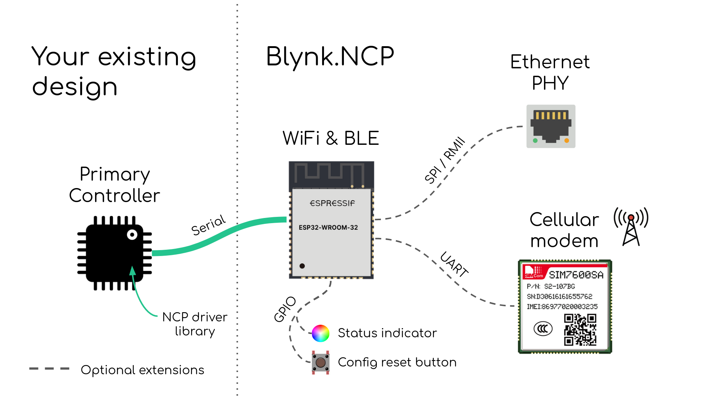
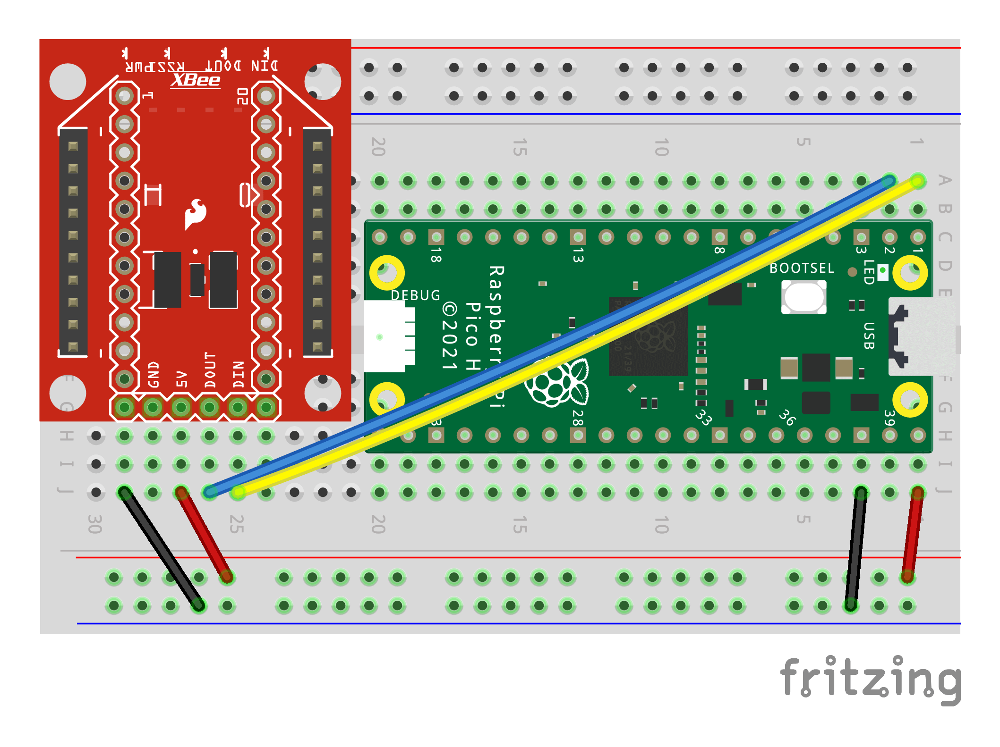

# Building a new device using Blynk.NCP



## Components Used in This Project

You will need:
- Raspberry Pi Pico
- One of the supported connectivity modules (see the table below)
- Breadboard and some jumper wires

## 1. Flash `Blynk.NCP` firmware to your connectivity module

1. Please follow the official firmware flashing guide. This is usually supplied by the module vendor.
2. Blynk.NCP is shipped as a combined firmware, so you only need to flash a single file (flash at address `0`).
3. Select the [firmware file, corresponding to your module type](https://github.com/blynkkk/BlynkNcpDriver/blob/main/docs/Supported%20Modules.md).

## 2. Assemble the board

Connect Blynk.NCP to the Primary MCU of your choice (i.e. `STM32`, `ATmega`, `RP2040` or `ATSAMD`) using UART.  
For example, here's how to connect the XBee form factor modules (`Macchina SuperB`, `DFRobot WiFi Bee`) to the `Raspberry Pi Pico` board:



## 3. Use the Blynk-provided library to communicate with the NCP

There are several options here:
- [`BlynkNcpDriver`](https://github.com/blynkkk/BlynkNcpDriver) - a low-level, `C99` compatible driver with minimal dependencies
- [`Blynk library`](https://github.com/blynkkk/blynk-library) provides an optional `C++11` convenience wrapper for the driver

In this project, we'll use the full-fledged Blynk library.

## 4. Upload the firmware to your `Primary MCU`

- To use `BlynkNcpDriver`, see [this example](https://github.com/blynkkk/BlynkNcpDriver/tree/main/examples/BlynkNCP_Simple)
- To use `Blynk` C++ library for Arduino, see [this example](https://github.com/blynkkk/BlynkNcpExample)
 
The expected debug output looks like this:

```log
[1345] NCP responding (baud 115200, 2289 us)
[1349] Blynk.NCP firmware: 0.4.6
[1684] State: Configuration
```

## 5. Use the **Blynk mobile app** (iOS/Android) to configure your new device

Ensure that the Blynk App is installed on your smartphone and scan this QR code:


Alternatively: open the `Blynk App` -> click `Add New Device` -> select `Find Devices Nearby`

## 6. Next steps

When using `BlynkNcpDriver` directly or integrating `Blynk.NCP` with non-Arduino boards, additional development may be needed to support features like the primary MCU OTA upgrades, Time and Location API, etc.

Please check out the [BlynkNcpDriver docs](https://github.com/blynkkk/BlynkNcpDriver/tree/main/docs) for further details.

## Disclaimer

> The community edition of **Blynk.NCP** is available for personal use and evaluation.  
If you're interested in using **Blynk.NCP** for commercial applications, feel free to [contact Blynk][blynk_sales]. Thank you!
