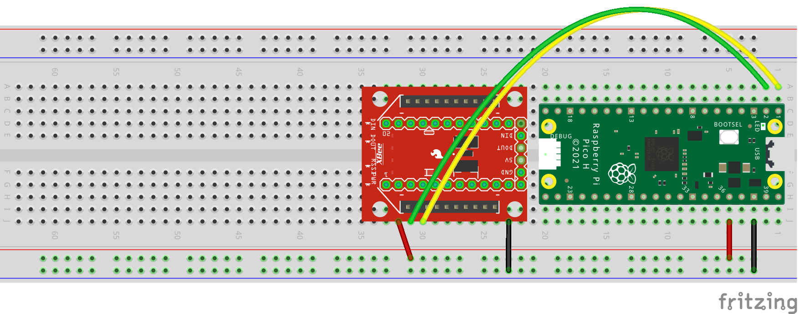

# Building a new device using Blynk.NCP


## Supported connectivity modules

Connectivity module              | Firmware file               | Chipset         | Connectivity | Provisioning | Interaction
:--                              | :---                        | :---            | ---          | ---          | ---
[ESP32-MINI-1][10]               | [link][generic_esp32_4M]    | `ESP32`         | WiFi 2.4     | BLE          |
[ESP32-C3-MINI-1][10]            | [link][generic_esp32c3_4M]  | `ESP32-C3`      | WiFi 2.4     | BLE          |
[ESP32-S3-MINI-1-N8][10]         | [link][generic_esp32s3_8M]  | `ESP32-S3`      | WiFi 2.4     | BLE          |
[ESP-WROOM-32 4MB][10]<br>(no PSRAM)   | [link][generic_esp32_4M] | `ESP32`      | WiFi 2.4     | BLE          |
[U-blox NINA-W106][26]           | [link][generic_esp32_4M]    | `ESP32`         | WiFi 2.4     | BLE          |
[Adafruit AirLift][20]           | [link][generic_esp32_4M]    | `ESP32`         | WiFi 2.4     | BLE          | RGB LED
[Macchina SuperB][21]            | [link][generic_esp32_4M]    | `ESP32`         | WiFi 2.4     | BLE          | Green LED
[TTGO T-Internet-POE][22]        | [link][lilygo_poe]          | `ESP32+LAN8720` | WiFi 2.4, Ethernet POE | BLE    |
[Seeed WT32-ETH01][23]           | [link][wt32_eth01]          | `ESP32+LAN8720` | WiFi 2.4, Ethernet     | BLE    |
[Witty Cloud][24]                | [link][generic_esp8266_4M]  | `ESP8266`       | WiFi 2.4     | WiFiAP       | RGB LED, User Button
[DFRobot WiFi Bee][25]           | [link][generic_esp8266_4M]  | `ESP8266`       | WiFi 2.4     | WiFiAP       | User Button
ESP-07S, ESP-12F                 | [link][generic_esp8266_4M]  | `ESP8266`       | WiFi 2.4     | WiFiAP       |

## 1. Flash `Blynk.NCP` firmware to your connectivity module

1. Please follow the official firmware flashing guide. This is usually supplied by the module vendor.
2. Blynk.NCP is shipped as a combined firmware, so you only need to flash a single file (flash at address `0`).
3. Select the corresponding firmware file, depending on your module type.

## 2. Assemble the board

Connect Blynk.NCP to the Primary MCU of your choice (i.e. `STM32`, `ATmega`, `RP2040` or `ATSAMD`) using UART.  
For example, here's how to connect the XBee form factor modules (`Macchina SuperB`, `DFRobot WiFi Bee`) to the `Raspberry Pi Pico` board:



## 3. Use the Blynk-provided library to communicate with the NCP

There are several options here:
- [`BlynkNcpDriver`](https://github.com/blynkkk/BlynkNcpDriver) - a low-level, `C99` compatible driver with minimal dependencies
- [`Blynk library`](https://github.com/blynkkk/blynk-library) provides an optional `C++11` convenience wrapper for the driver

In this project, we'll use the full-fledged Blynk library.

## 4. Upload the firmware to your `Primary MCU`

- To use `BlynkNcpDriver`, see [this example](https://github.com/blynkkk/BlynkNcpDriver/tree/main/examples/BlynkNCP_Simple)
- To use `Blynk` C++ library for Arduino, see [this example](https://github.com/blynkkk/BlynkNcpExample)
 
The expected debug output looks like this:
```log
[1345] NCP responding (baud 115200, 2289 us)
[1349] Blynk.NCP firmware: 0.4.6
[1684] State: Configuration
```

## 5. Use the **Blynk mobile app** (iOS/Android) to configure your new device

Open the Blynk App and click "Add New Device"

## 6. Next steps

When using `BlynkNcpDriver` directly or integrating `Blynk.NCP` with non-Arduino boards, additional development may be needed to support features like the primary MCU OTA upgrades, Time and Location API, etc.

Please check out the [BlynkNcpDriver docs](https://github.com/blynkkk/BlynkNcpDriver/tree/main/docs) for further details.


[10]: https://www.espressif.com/en/products/modules

[20]: https://www.adafruit.com/product/4201
[21]: https://www.macchina.cc/catalog/m2-accessories/superb
[22]: https://www.lilygo.cc/products/t-internet-poe
[23]: https://www.seeedstudio.com/Ethernet-module-based-on-ESP32-series-WT32-ETH01-p-4736.html
[24]: https://protosupplies.com/product/esp8266-witty-cloud-esp-12f-wifi-module/
[25]: https://www.dfrobot.com/product-1279.html
[26]: https://www.u-blox.com/en/product/nina-w10-series-open-cpu

[generic_esp8266_4M]: https://github.com/blynkkk/BlynkNcpDriver/releases/latest/download/BlynkNCP_generic_esp8266_4M.flash.bin
[generic_esp32_4M]: https://github.com/blynkkk/BlynkNcpDriver/releases/latest/download/BlynkNCP_generic_esp32_4M.flash.bin
[generic_esp32c3_4M]: https://github.com/blynkkk/BlynkNcpDriver/releases/latest/download/BlynkNCP_generic_esp32c3_4M.flash.bin
[generic_esp32s3_8M]: https://github.com/blynkkk/BlynkNcpDriver/releases/latest/download/BlynkNCP_generic_esp32s3_8M.flash.bin
[lilygo_poe]: https://github.com/blynkkk/BlynkNcpDriver/releases/latest/download/BlynkNCP_lilygo_poe.flash.bin
[wt32_eth01]: https://github.com/blynkkk/BlynkNcpDriver/releases/latest/download/BlynkNCP_wt32_eth01.flash.bin
